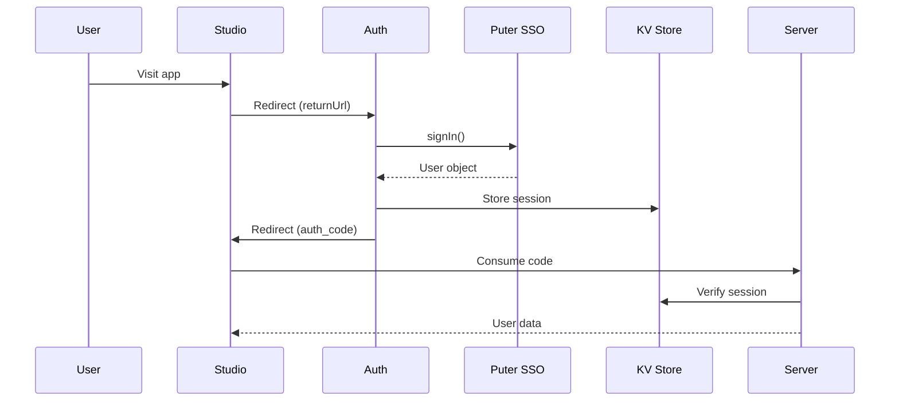

# GRUDGE Studio Network Architecture

## Overview

GRUDGE Studio uses a distributed multi-app architecture on Puter.com, with each app serving a specific purpose in the network.

## Network Topology

```
                    ┌─────────────────────────────────────────┐
                    │              INTERNET                   │
                    │         (User's Browser)                │
                    └────────────────┬────────────────────────┘
                                     │
                    ┌────────────────▼────────────────────────┐
                    │           PUTER.COM CDN                 │
                    │      (Global Edge Distribution)         │
                    └────────────────┬────────────────────────┘
                                     │
         ┌───────────────────────────┼───────────────────────────┐
         │                           │                           │
         ▼                           ▼                           ▼
┌────────────────┐        ┌────────────────┐        ┌────────────────┐
│  GRUDGE-AUTH   │◄──────►│ GRUDGE-STUDIO  │◄──────►│ GRUDGE-SERVER  │
│   (SSO Hub)    │        │   (Frontend)   │        │   (API/AI)     │
│  Static HTML   │        │  React/Vite    │        │    Node.js     │
└────────┬───────┘        └────────┬───────┘        └────────┬───────┘
         │                         │                         │
         │                         │                         │
         └─────────────────────────┼─────────────────────────┘
                                   │
                    ┌──────────────▼──────────────┐
                    │        PUTER CLOUD          │
                    │  ┌────────┐  ┌────────┐     │
                    │  │   KV   │  │   FS   │     │
                    │  │ Store  │  │Storage │     │
                    │  └────────┘  └────────┘     │
                    │  ┌────────┐  ┌────────┐     │
                    │  │   AI   │  │Workers │     │
                    │  │ Models │  │        │     │
                    │  └────────┘  └────────┘     │
                    └─────────────────────────────┘
                                   │
                    ┌──────────────▼──────────────┐
                    │      GRUDGE-CLOUD           │
                    │    (Admin Storage)          │
                    │      Static HTML            │
                    └─────────────────────────────┘
```

## App Specifications

### 1. GRUDGE-AUTH (SSO Hub)

| Property | Value |
|----------|-------|
| App ID | `app-78a6cac4-afb0-45a2-8074-90d687b41770` |
| Type | Static Web App |
| URL | `https://grudge-auth.puter.site` |
| Primary Function | Authentication & Session Management |

**Endpoints:**
- `GET /` - Login page with Puter SSO button
- `GET /verify?code={code}` - Verify session validity
- `GET /logout?returnUrl={url}` - Terminate session

**Data Flow:**
```
1. User clicks "Sign In" in Studio
2. Redirect to Auth with returnUrl
3. Auth calls puter.auth.signIn()
4. Puter SSO authenticates user
5. Auth creates session in KV
6. Redirect back with auth_code
```

### 2. GRUDGE-STUDIO (Frontend)

| Property | Value |
|----------|-------|
| App ID | `grudge-warlords` |
| Type | React/Vite Static App |
| URL | `https://grudge-warlords.puter.site` |
| Primary Function | Main Application UI |

**Features:**
- 5 Profession skill trees
- 518 Crafting recipes
- Character management
- Shop & inventory
- Command Center (AI chat)
- NPC Chat system

**Dependencies:**
- Auth: For user authentication
- Server: For AI features and data sync
- Cloud: For admin storage (admin only)

### 3. GRUDGE-SERVER (API/AI)

| Property | Value |
|----------|-------|
| App ID | `app-f9ad7ff9-1a2e-4bb0-a20a-8db9db03a620` |
| Type | Node.js Worker App |
| URL | `https://grudge-server.puter.site` |
| Primary Function | Backend API & AI Processing |

**API Endpoints:**
| Method | Path | Auth | Description |
|--------|------|------|-------------|
| GET | /api/health | No | Health check |
| POST | /api/auth/consume | No | Exchange auth code |
| GET | /api/auth/verify | Yes | Verify session |
| POST | /api/ai/chat | Yes | AI chat |
| POST | /api/ai/vision | Premium | Image analysis |
| POST | /api/sprites/generate | Admin | Generate sprites |
| GET | /api/jobs/:id | Yes | Job status |
| POST | /api/npc/chat | Yes | NPC conversation |
| POST | /api/data/sync | Admin | Sync game data |

### 4. GRUDGE-CLOUD (Admin Storage)

| Property | Value |
|----------|-------|
| App ID | `app-72f20857-03d2-4551-b6fd-7bf1f90a2cf0` |
| Type | Static Web App |
| URL | `https://grudge-cloud.puter.site` |
| Primary Function | Admin Storage Management |

**Features:**
- File browser for Puter FS
- KV store viewer/editor
- Sprite library manager
- Backup/restore tools

**Access:** Admin/Developer roles only

## Communication Protocols

### Authentication Flow



### API Request Format

```javascript
// Headers
{
  "Authorization": "Bearer {auth_code}",
  "Content-Type": "application/json"
}

// Request Body
{
  "action": "...",
  "data": { ... }
}

// Response (Success)
{
  "success": true,
  "data": { ... }
}

// Response (Error)
{
  "error": "Error message",
  "status": 400
}
```

## KV Store Namespacing

All apps share the same KV store. Use prefixes to avoid collisions:

| Prefix | Owner | Purpose |
|--------|-------|---------|
| `grudge_session_` | Auth | User sessions |
| `grudge_npc_` | Server | NPC memory |
| `grudge_job_` | Server | Job queue |
| `grudge_data_` | Server | Game data |
| `grudge_asset_` | Cloud | Asset metadata |
| `grudge_chat_` | Server | Chat history |
| `grudge_account_` | All | User accounts |

## File System Structure

```
/grudge-warlords/
├── assets/
│   ├── sprites/
│   │   ├── characters/
│   │   ├── weapons/
│   │   ├── armor/
│   │   ├── items/
│   │   └── effects/
│   ├── icons/
│   ├── backgrounds/
│   └── audio/
├── data/
│   ├── recipes/
│   ├── weapons/
│   ├── armor/
│   └── reports/
├── backups/
│   ├── daily/
│   └── manual/
└── exports/
```

## Security Model

### Role Hierarchy

```
ADMIN (full access)
  ↓
DEVELOPER (admin features, no secrets)
  ↓
AI_AGENT (automated operations)
  ↓
PREMIUM (enhanced features)
  ↓
USER (standard features)
  ↓
GUEST (read-only, limited)
```

### Role-Based Access

| Feature | Admin | Developer | Premium | User | Guest |
|---------|-------|-----------|---------|------|-------|
| View Dashboard | ✓ | ✓ | ✓ | ✓ | ✓ |
| Craft Items | ✓ | ✓ | ✓ | ✓ | ✗ |
| AI Chat | ✓ | ✓ | ✓ | ✓ | ✗ |
| Command Center | ✓ | ✓ | ✓ | ✗ | ✗ |
| Sprite Generator | ✓ | ✓ | ✗ | ✗ | ✗ |
| Admin Panel | ✓ | ✓ | ✗ | ✗ | ✗ |
| Cloud Storage | ✓ | ✓ | ✗ | ✗ | ✗ |

### Session Security

1. Sessions stored in KV with expiration
2. Auth codes are single-use
3. Session verified on every API call
4. Role validated server-side
5. 24-hour session lifetime

## Performance Optimization

### CDN Strategy

- Static assets served via Puter CDN
- Edge caching for frequently accessed files
- Lazy loading for large assets

### API Optimization

- Request batching where possible
- Response caching in KV
- Async job processing for heavy tasks

### KV Best Practices

- Always JSON.stringify objects
- Keep keys under 256 characters
- Use indexes for list operations
- Clean up expired data periodically

## Monitoring & Health

### Health Endpoints

Each app should expose `/api/health`:

```javascript
{
  "status": "healthy",
  "app": "grudge-server",
  "version": "2.5.0",
  "timestamp": "2025-12-30T00:00:00.000Z",
  "services": {
    "kv": "operational",
    "ai": "operational",
    "fs": "operational"
  }
}
```

### Metrics to Track

- Request latency (p50, p95, p99)
- Error rates by endpoint
- Active sessions count
- AI usage (tokens/requests)
- Storage usage (KV entries, file size)

## Deployment Pipeline

```bash
# 1. Build all apps
npx tsx puter/deploy/multi-app-deploy.ts

# 2. Deploy all apps
npx tsx puter/deploy/auto-deploy-all.ts

# 3. Verify health
curl https://grudge-server.puter.site/api/health
curl https://grudge-auth.puter.site/
curl https://grudge-cloud.puter.site/
curl https://grudge-warlords.puter.site/
```

---

*© 2025 GRUDGE Studio. Network Architecture Documentation.*
